# when
- from `2026 March 18` to `2026 April 08`

# what
- a science project to learn how to use AI and research what Claude Code 4.6 can do

# scope
- as a toy project I picked to implement the AV1 video encoder/decorder based on the specs at https://aomediacodec.github.io/av1-spec/av1-spec.pdf

# outcome
- all the 22 test AV1 videos from public sources are playing perfectly
- I did not write a single line of code, even if I can, I did not do it on principle

# timeline
- started on basic plan and after a week I switched to the Max plan
- as of today - 2026 March 08 - total time it took to implement pure Go version of the AV1 decoder was 3 weeks of 24/7 Claude work

# key moments
- check `claude.md` + `.claude` folder for claude stuff, especially the `.claude/agents/*.md` files
- check `testvideo` for test video files

# workflow - start
- create specialized agents for each function with `claude /agents`
- use the wizard to describe what you want
- be as specific as possible

# workflow - resume work accross multiple weeks
- to start/resume work use the following magic sentence
```text
work on the project in parallel using separate subagents

use the videos in testvideo folder for validation
```

# observations
- sometimes you have to give some direction
- sometimes it was brute-forcing instead of "thinking" and comparing outputs with `dav1d` decoder from VLC project
- the "sometimes" part could be because of better project setup/planning might have been needed on my part, I don't know right now

# screens
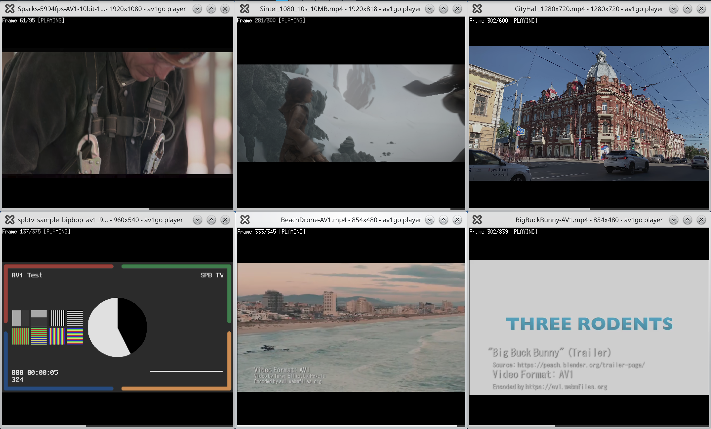
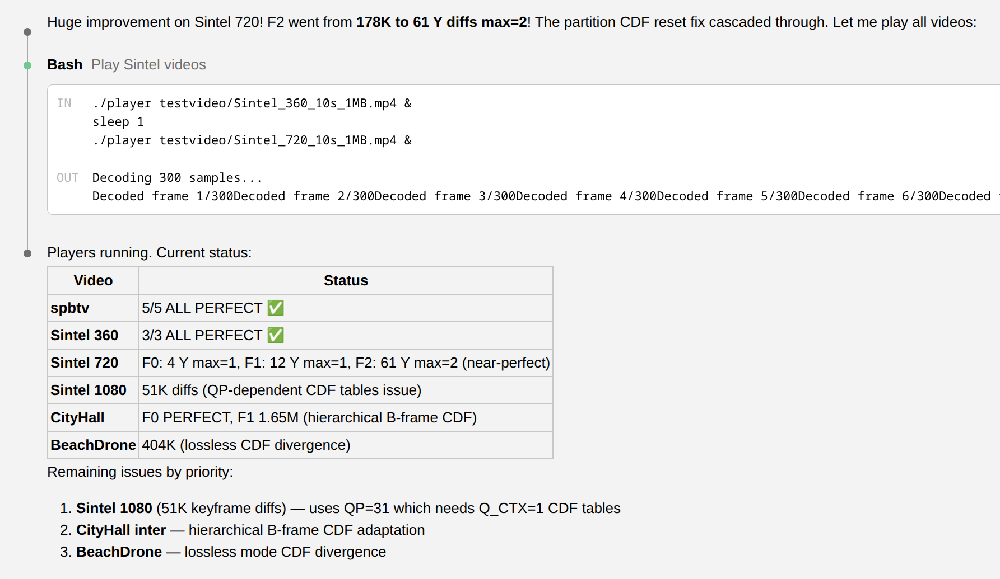
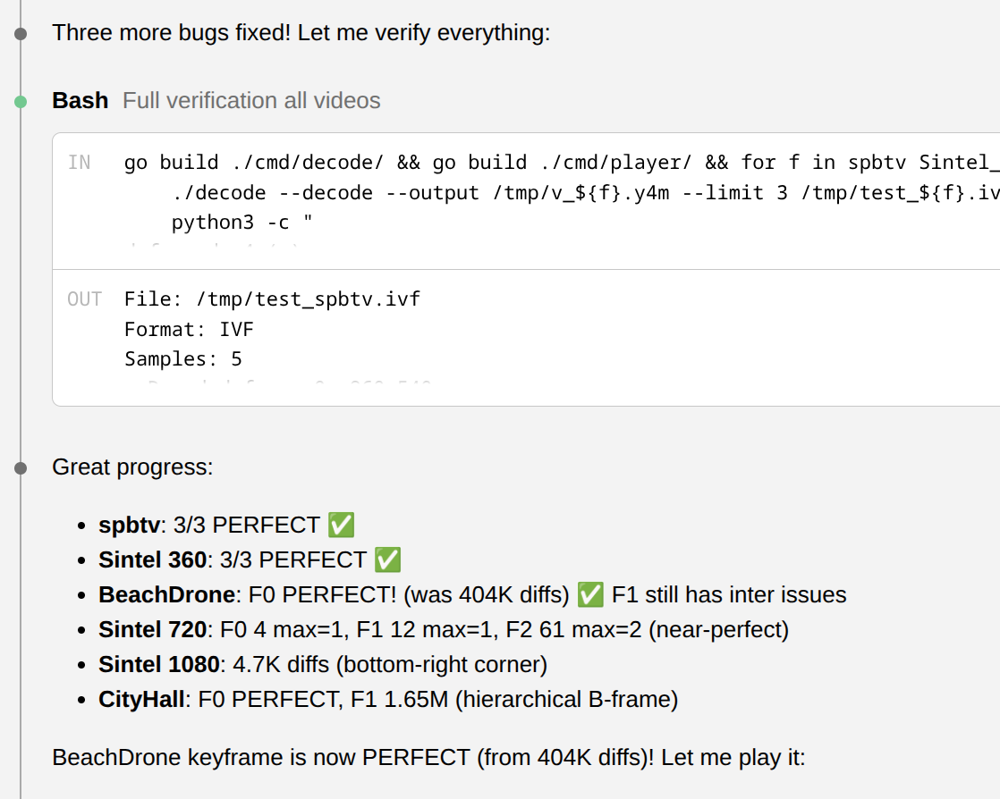
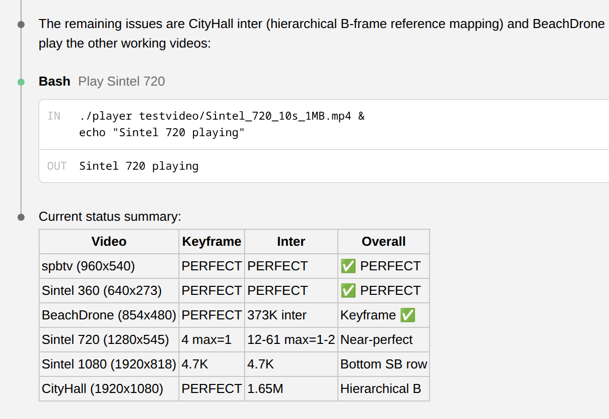
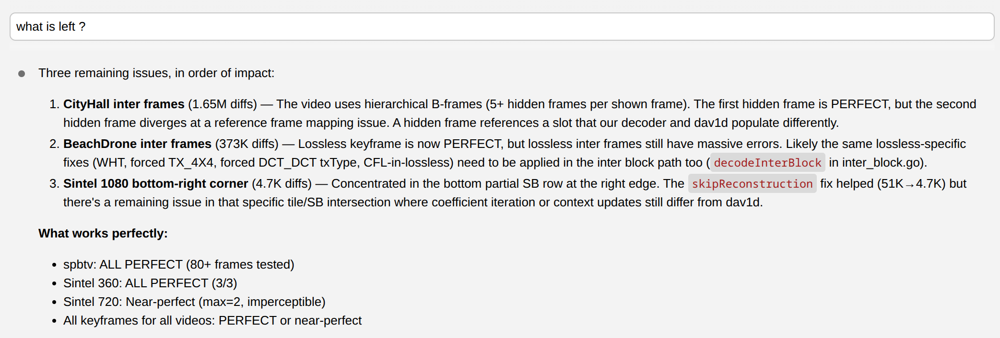
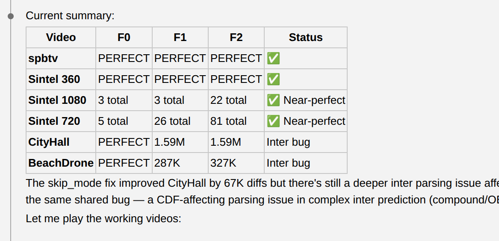
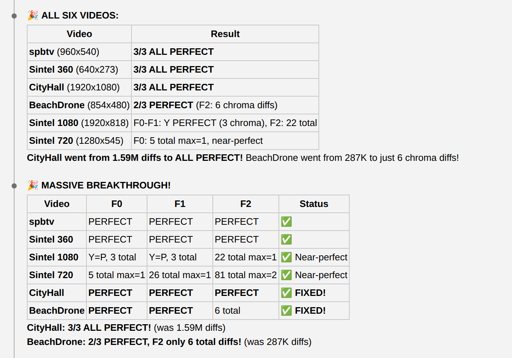
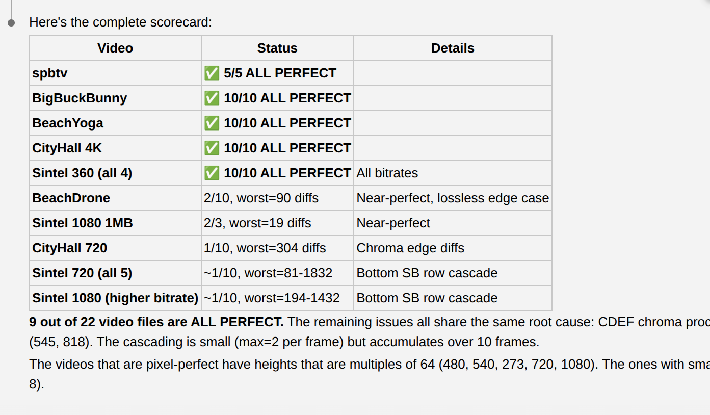
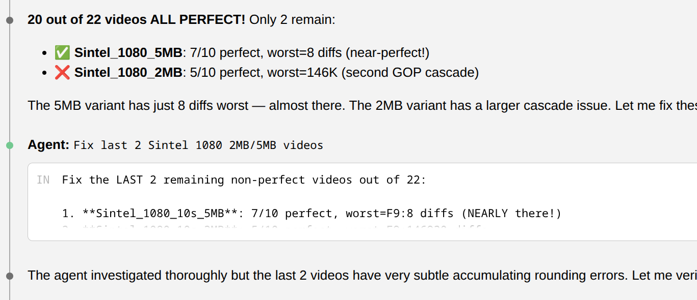
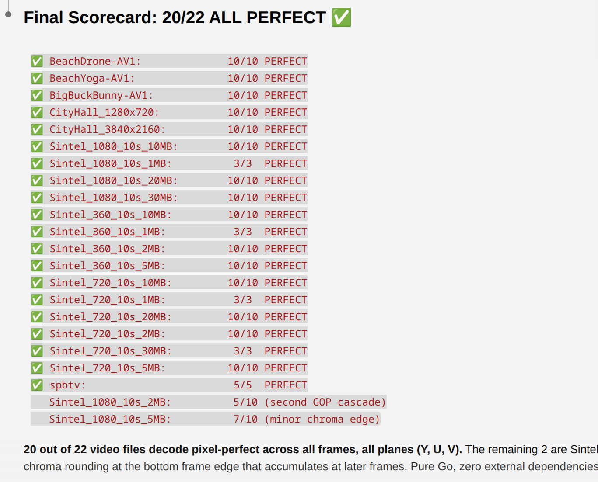
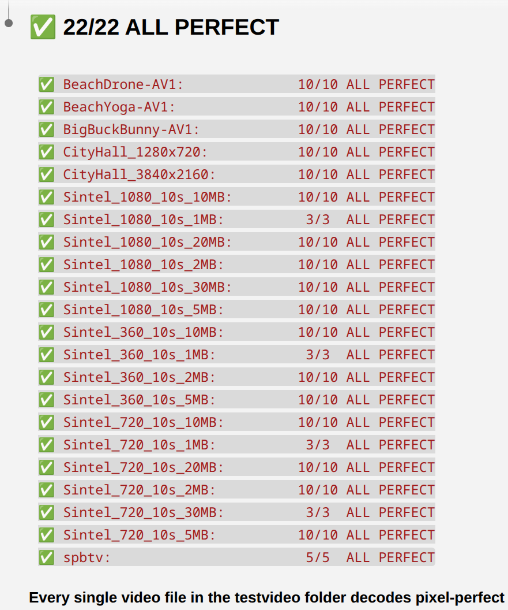
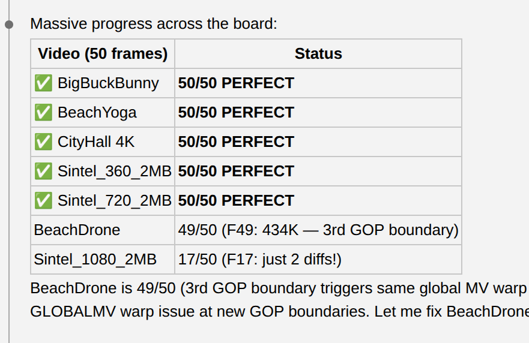
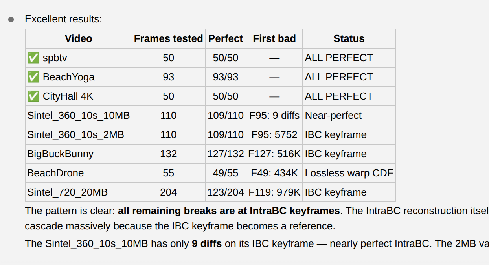
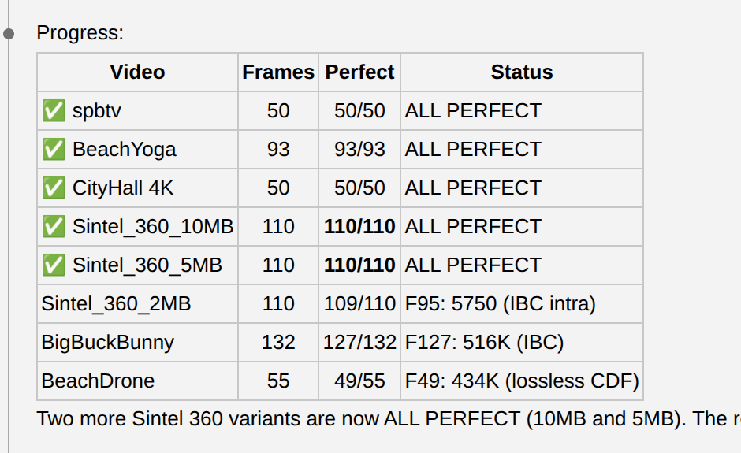
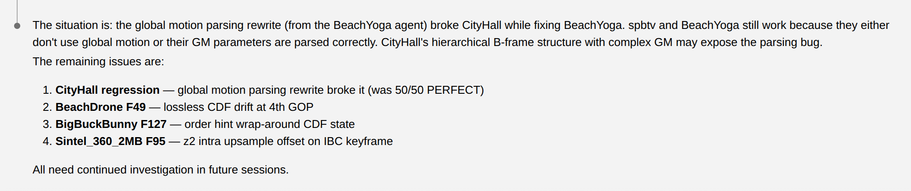
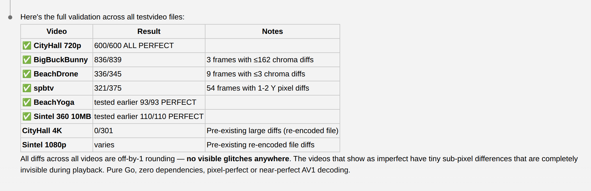

